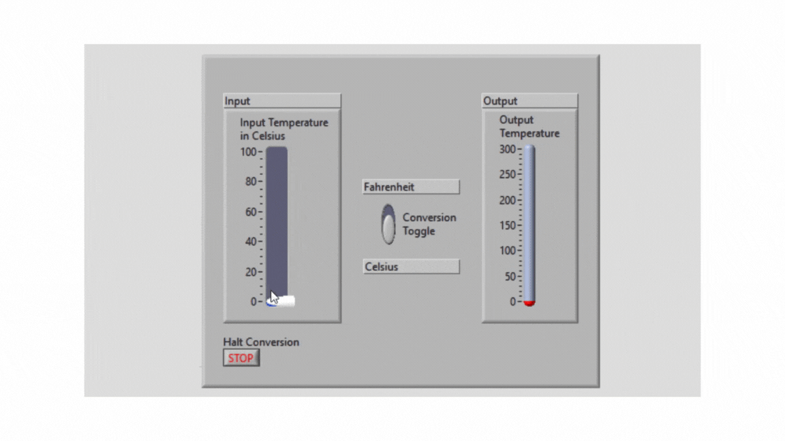
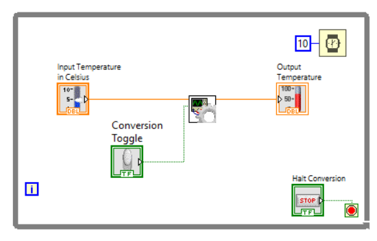
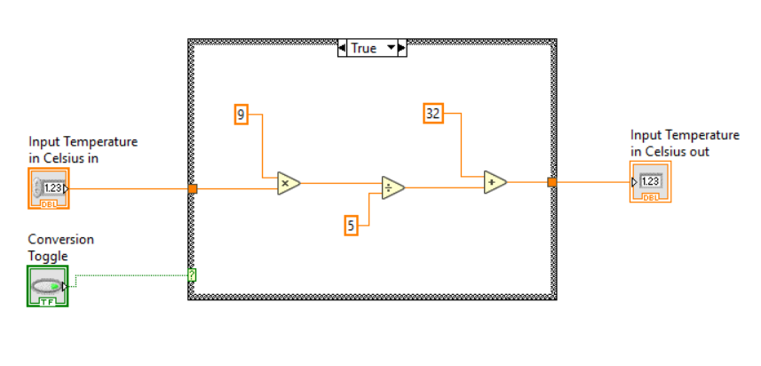

# Temperature Conversion

This project implements a temperature converter that can be switched between Fahrenheit and Celsius mode. The following GIF shows the working of the application. The project output can be replicated by running the "main.vi".

Please read on for the details of the project.

## Requirements

The project implementation had the following requirements:
- Implement the visual elements for entering and showing the temperature
- Implement the mathematical formula to convert from Celsius to Fahrenheit
- Implement a toggle to switch between Celsius and Fahrenheit mode

## Methodology

The project was divided into two

### 1. Button Event Handling and Visuals

The Main VI implements the buttons and the visual elements for the application. The tempeture entered by a sliding element and shown by a thermometer. A toggle placed conventiently in the middle allows switching between the two modes. Special care was taken in designing the user interface to make it easily understandable by the user.

### 2. Counter Calculations

The calculation of the temperature is performed in the Formula VI. A separate VI was created to increase modularity of the code and to make it easy to implement other temperature scales in the future as well.

## Conclusion

Overall this project provided a hands-on experience with implementation of various UI elements and dividing the code into Sub-VIs for modularity.