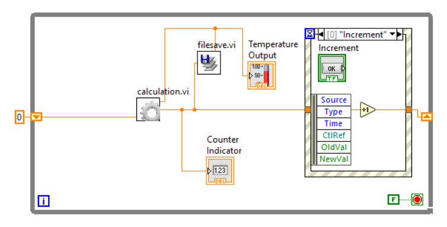
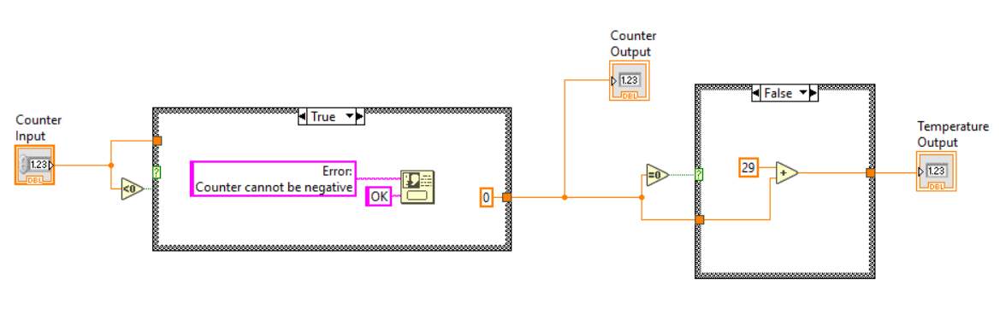
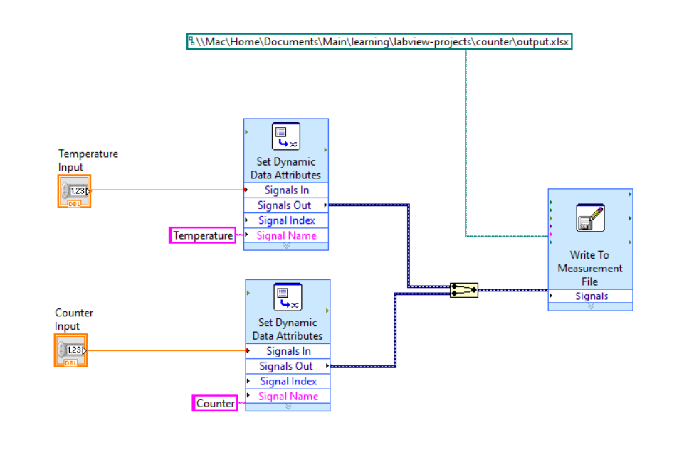

# Counter with Event Handling

This project implements a counter application using button value change event handling in LabVIEW. The following GIF shows the working of the application. The project output can be replicated by running the "main.vi".

Please read on for the details of the project.

## Requirements

The project implementation had the following requirements:
- Implement a counter that can be incremented or decremented
- Implement buttons that can increment and decrement the counter
- Implement a visual elements (temperature guage and indictor) to show the status of the counter
- Save the values of the counter and the temperature calculations to a TDMS file

## Methodology

The project was divided into three sections that are reflected by the number of Sub VIs implemented.

### Button Event Handling and Visuals

The Main VI implements the buttons and the visual elements for the application. The button clicks are monitored using an event handling case that captures the value changes of the buttons. Using that information, the counter value is either incremented or decremented. The value is passed on to the next iteration of the loop using shift registers. The counter value is then processed at the start of the interation in the Calculation VI and the Filesave VI. 

### Counter Calculations

The calculations on the counter are necessary to make sure the counter is not negative. If that is a case, then a dialog message is generated and the counter is reverted back to 0. The temperature reading must be 29 more than the counter reading which is also calcualted in this VI.

### File Saving

The Filesave VI implemented the funcionality to save the counter and the calculated temperature values as a TDMS file.

## Conclusion

Overall this project provided a hands-on experience with event handling in LabVIEW applications as well as working with filesystem to save measurement values.