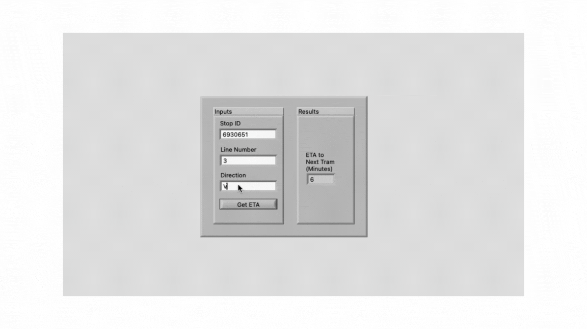
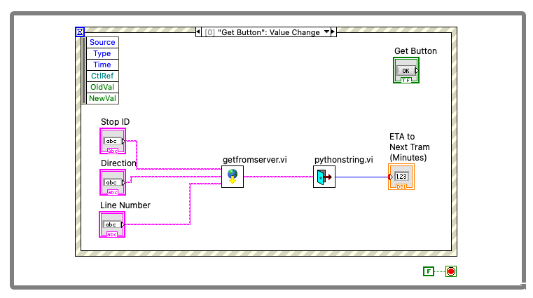
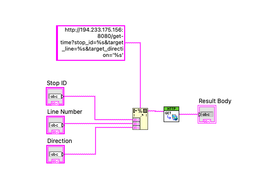
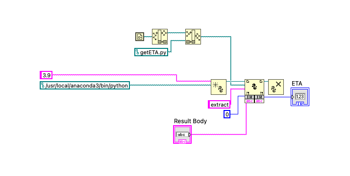

# Get ETA of Next Tram

This projects implements the functionality to get the ETA of next tram at the specified station. The application only works in the state of Baden-Württemberg in Germany with a known tram stop ID, line number and direction. The following GIF shows the working of the application. The project output can be replicated by running the "main.vi".

Please read on for the details of the project.

## Requirements

The project implementation had the following requirements:
- Implement the UI elements to take in the Stop ID, tram line number and the tram direction as well as a field to show the ETA.
- Perform HTTP GET Request to server to get the information for the next tram.
- Perform simple string processing by connection Python to the VI.

## Methodology

The project was divided into three sections that are reflected by the number of Sub VIs implemented.

### 1. Button Event Handling and Visuals

The Main VI implements the buttons and the visual elements for the application. The button clicks are monitored using an event handling case that captures the value changes of the buttons. Using that information, the routine of the application is triggered. The values from the text fields are read an HTTP request is performed followed by string processing in Python. The results are shown in the output string box.

### 2. HTTP GET Request

This VI implements the necessary string formatting to assemble the URL for the HTTP GET request and then subsequently performs that GET request. The results is returned to the output.

### 3. Python Call

This VI implements the functionality to setup and call a specific function in a Python module defined in a separate file. The string processing performed here is rather simple but Python is a very capable language with strong data processing features that can be leveraged by the interface that we have just established.

## Conclusion

Overall this project provided a hands-on experience with event handling and performing HTTP requests to obtain data from servers on the internet in LabVIEW applications as well as running Python code which can be a very powerful technique for data and image processing.